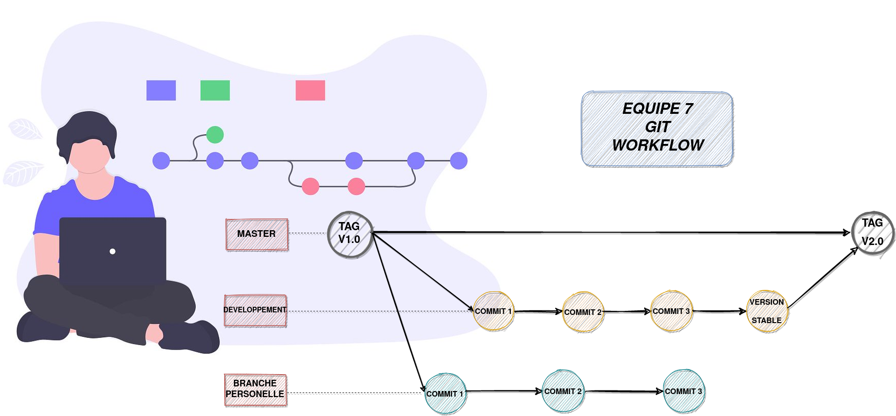

## GIT WORKFLOW

Notre équipe a décidé de travailler selon le modèle illustré ci-dessous.
+   Nous avons décidé de garder la branche ***master*** pour les versions "stables" (remise de chaque TP).
+   Nous avons donné un tag **V1.0** pour la version remise pour le TP1 et nous avons créé une branche ***developpement*** à partir de là.
+   Nous avons fait nos commit sur la branche ***developpement***.
+   Une fois arrivés à une version complète, qui satisfait à notre définition de travail terminé décrite dans le fichier [equipe.md](https://gitlab.info.uqam.ca/inf2050-h21/equipe7/equipe7/-/blob/master/equipe.md), on fait un pull request pour ramener cette version sur la branche ***master***.
+   Cette version aura un tag **V2.0**.
+   Chaque développeur sur le projet a une branche personnelle où il peut travailler localement.

### Illustration du workflow

